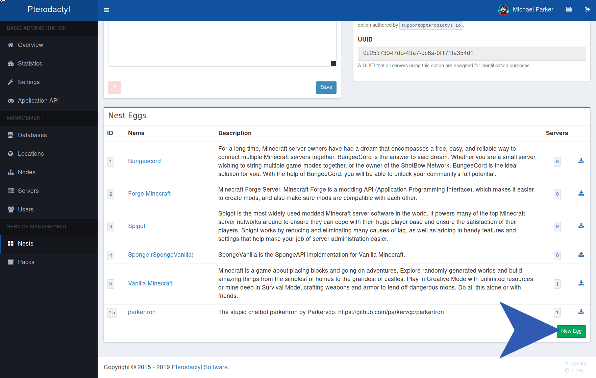
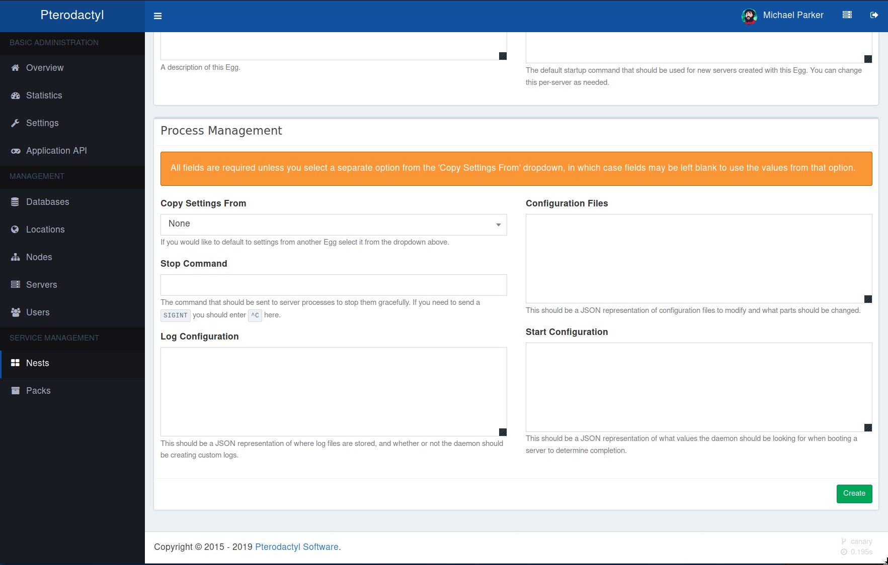
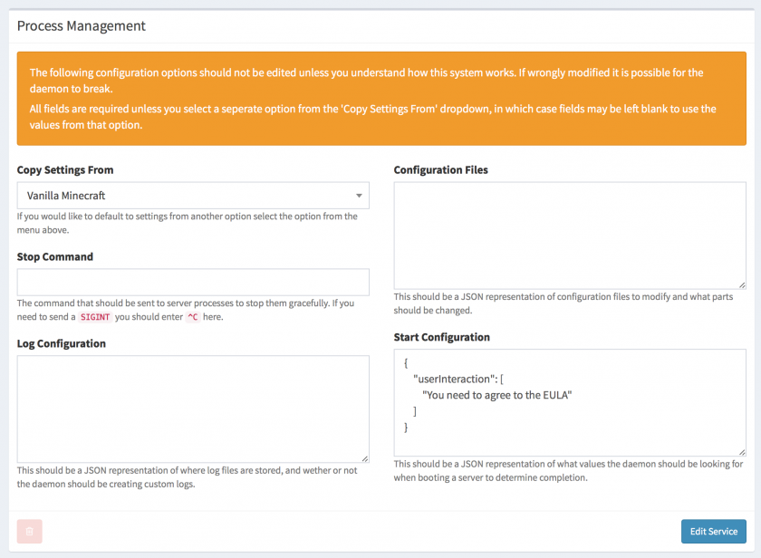
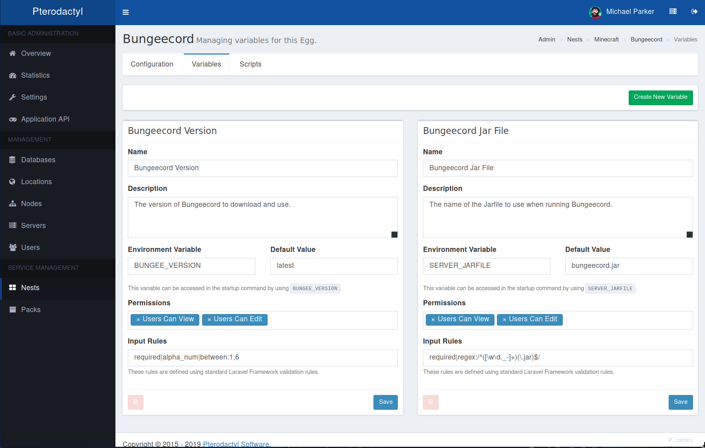
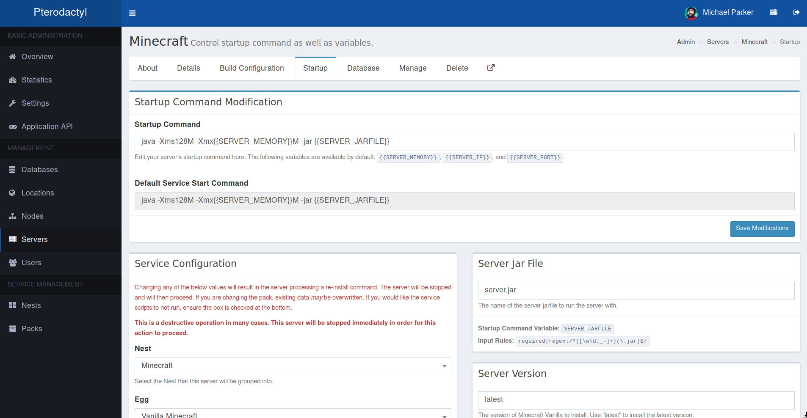

# 创建自定义预设
::: warning
您不应编辑面板随附的现有预设。我们每次对这些预设的更新，在你更新数据库时会覆盖面板的原有预设，也就是说你将丢失这些所有改动的内容。
:::

[[toc]]

您需要做的第一件事是创建一个新的预设组(类似文件夹)。名称和描述就不言而喻了。`预设组名称` _需要确保唯一性_ ，不被其他任何预设组使用，并且只能包含字母、数字、下划线和破折号(中文也是可以的)。这是守护进程存储预设的预设组名称。

预设的默认启动命令也是必需的，但是可以根据变量进行动态更改。

## 创建新的预设
创建完预设组后, 点击页面右下角的 `新预设` 按钮。



大多数配置都将在随后打开的这个预设设置页面中进行. 你要做的第一件事情就是从 `所属预设组` 下拉框中选择你的预设属于哪个预设租。



随后为你的预设起一个名字并填写在 `预设名` 中, 在这个样例中我使用了 `Widget` 这个名字. 你还需要提供一个有效的docker镜像和启动命令 (启动命令在具体的服务器创建后可以单独针对此服进行再次编辑)。

_Docker images 必须是专门设计用于翼龙面板的那些。_ 你可以在我们的[创建docker镜像](/community/config/eggs/creating_a_custom_image.md) 指南中阅读更多相关信息。

## 进程管理识别
这是配置界面中最重要的一步, 这些信息能让进程知道如何启动并管理这个游戏预设。


第一个空是 `复制设置自`，默认为 `无`，如果你已经配置好了一个类似的预设，想要快速配置这些信息就可以点击下拉框并选中。

### 关机指令
下一个空是 `关机指令`，这个命令将用于安全的停止服务器，例如在我的世界里，通常使用 `stop` 命令来关闭服务器。当然也有一些游戏没有相关的管理员命令，例如幻兽帕鲁(也许未来会更新加入)。这种情况直接填入 `^C` 让守护进程执行一个 `SIGINT`来结束进程。

### 日志存储
现在日志完全由守护进程处理，并利用docker从服务器输出完整的日志。设置案例如下。

```json
{}
``` 

### 配置文件
接下来的 `配置文件` 是最重要的一个空. 在服务器启动之前,守护进程将会落实这些配置以确保服务器能够正确的应用。

```json
{
    "server.properties": {
        "parser": "properties",
        "find": {
            "server-ip": "0.0.0.0",
            "enable-query": "true",
            "server-port": "{{server.build.default.port}}",
            "query.port": "{{server.build.default.port}}"
        }
    }
}
```

在这个例子中, 我们让守护进程从 `/home/container` 路径读取 `server.properties` 这个文件. 在这个代码块里, 我们定义了一个解析器(`parser`)，在这里是 `properties` 但以下也是 [有效的解析器](https://github.com/pterodactyl-china/wings/blob/develop/parser/parser.go#L25-L30):

* `file` — 此解析器基于匹配行的开头，而不是像其他五个解析器一样基于特定属性。如果可能的话，请避免使用此解析器。
* `yaml` (支持 `*` 符号)
* `properties`
* `ini`
* `json` (支持 `*` 符号)
* `xml`

定义了文件类型之后, 接下来开始编辑 `find` 代码块, 这将会让守护进程知道哪些特殊的元素需要被查找并替换. 在这个例子里, 可以看到代码块里填了4个 `server.properties` 文件中元素,这将会查找并自动替换这些元素为我们想要的值. 你可以使用精确的值，也可以从 `server.json` 文件中定义特殊的设置. 在本例中，我们将默认服务器端口指定为 `server-port` 和 `query.port`. **这些占位符区分大小写, 并且不能含有空格.**

你可以在这里同时监听多个文件, 守护进程将在启动服务器之前检查并处理它们. 当文件是 `yaml` 或 `json` 类型时，你可以使用更高级的元素搜索方式.

```json
{
    "config.yml": {
        "parser": "yaml",
        "find": {
            "listeners[0].query_enabled": true,
            "listeners[0].query_port": "{{server.build.default.port}}",
            "listeners[0].host": "0.0.0.0:{{server.build.default.port}}",
            "servers.*.address": {
                "127.0.0.1": "{{config.docker.interface}}",
                "localhost": "{{config.docker.interface}}"
            }
        }
    }
}
```

在这个例子里, 我们定义了 `config.yml` 文件，它的类型时 `yaml`. 前三个元素只是简单的设定了端口和ip. 最后一个 `servers.*.address` 使用了 * 来匹配 `servers` 中的任意项目, 并找到当中的每一个 `address` 元素.

::: v-pre
文件配置中有一个高级用法可以只用一行代码就能做到匹配并替换多个元素. 在本例中, 我们正在寻找 `127.0.0.1` 或 `localhost` 并且替换他们为docker中接口配置 `{{config.docker.interface}}`. 
:::

### 启动配置
最后一个模块是 `启动配置`。这将用于判定服务器是否处于运行（running）状态.

```json
{
    "done": ")! For help, type "
}
```

在上面这个例子, 我们定义了 `done` 作为一整行, 或者是代表服务器已完成启动并且已经准备好让玩家进入的其他输出(其中一部分即可). 当守护进程检测到这些输出时, 它会标记服务器已经成功启动了  `ON` 而不是启动中 `STARTING`.

基本预设配置到此结束,快去实践看看吧。

## 复制设置
如上所示, 添加新选项时，有一个独特的 `复制设置自` 下拉列表。顾名思义，这让你能够从不同的选项复制上面定义的设置。



在面板中，我们使用这个功能来复制在类似服务选项之间保持不变的设置，例如许多《我的世界》服务器当中的配置。

例如 `Sponge (SpongeVanilla)` 预设配置.

正如你所看到的，它被告知从 `Vanilla Minecraft`. 复制设置。这意味着任何留空将从指定的父级继承。然后我们定义一个特定的 `userInteraction` 元素，它与Sponge与Vanilla预设相比会有这个特定元素的区别，但别的一样。

*请注意，`复制设置自` 不支持嵌套复制，您只能从单个父项复制。并且被用于复制的预设 **其本身不能是复制其他预设的。.***

## 预设的变量
变量的一大优点是能够定义用户/管理员可以定义的特定变量，在不用让用户修改启动命令的情况下调整不同的设置。创建新变量或编辑现有的变量，请访问您创建的服务器预设界面，然后单击页面顶部的 `变量` 按钮。我们可以在一些例子里看看可以创建的变量示例。



::: v-pre
The name and description are rather self-explanitory, so I'll skip down to the `Environment Variable` box. This should
be an Alpha-Numeric name with underscores, and should be uppercase. This will be the name of the environment variable
which can be accessed in the startup command as `{{WOOZLE_WOO}}`, within file modifications as `{{env.WOOZLE_WOO}}`, or
just `${WOOZLE_WOO}` in any shell scripts (it is passed through in the environment). We also define a default value for
this environment variable in this example, but it is not required to do so.
:::

The next section is `Permissions`, which is a dropdown with two options: `Users Can View` and `Users Can Edit`.

* `Users Can View` — allows a user to view the field on the front-end, as well as the assigned value of that variable.
They will be able to see it replaced in their startup command.
* `Users Can Edit` — allows a user to edit the value of the variable, for example the name of their `server.jar` file
if running Minecraft.

You should use caution here, even if you assign neither of the permissions it does not mean that the value will be
hidden. Crafty users will still be able to get the environment on their server. In most cases this is simply hiding
it from the user, and then used within the Dockerfile to perform actions, thus it is not important for the user to see.

Finally, you will need to define some input rules to validate the value against. In this example, we use
`required|string|between:1,10`, which means the field is `required`, must be a `string`, and must be between `1` and
`10` characters in length. You can find [all of the available validation rules](https://laravel.com/docs/5.6/validation#available-validation-rules)
on the Laravel website. You can also use ReGEX based validation by using the `regex:` rule flag. For example,
[`required|regex:/^([\w\d._-]+)(\.jar)$/`](https://regex101.com/r/k4oEOn/1) will require the field, and will match the
regex as any letters or numbers (`\w\d`) including underscore (`_`), periods (`.`), and dashes (`-`) ending in `.jar`.

They will then be visible when managing the startup for a server in both the Admin CP and on the Front-End.



## List of default variables

默认变量对所有预设都是可访问的，不必单独创建。它们可以在egg启动、安装脚本或配置文件解析器中使用。

| 变量名                       | 描述           | 例子                                                             |
|---------------------------|--------------|----------------------------------------------------------------|
| TZ                        | 时区           | `Etc/UTC`                                                      |
| STARTUP                   | 预设的启动命令      | `java -Xms128M -Xmx{{SERVER_MEMORY}}M -jar {{SERVER_JARFILE}}` |
| SERVER_MEMORY             | 服务器的可用内存(MB) | `512`                                                          |
| SERVER_IP                 | 服务器的默认ip     | `127.0.0.1`                                                    |
| SERVER_PORT               | 服务器的首选端口     | `27015`                                                        |
| P_SERVER_LOCATION         | 服务器的位置       | `Example City`                                                 |
| P_SERVER_UUID             | 服务器的UUID     | `539fdca8-4a08-4551-a8d2-8ee5475b50d9`                         |
| P_SERVER_ALLOCATION_LIMIT | 服务器分配的端口数    | `0`                                                            |
