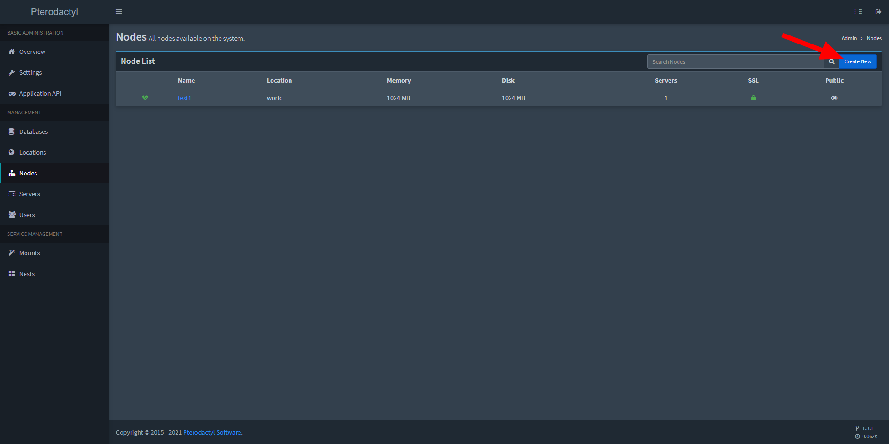
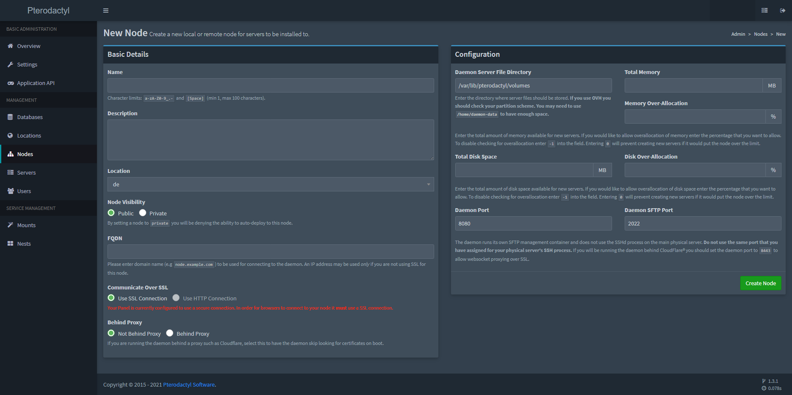
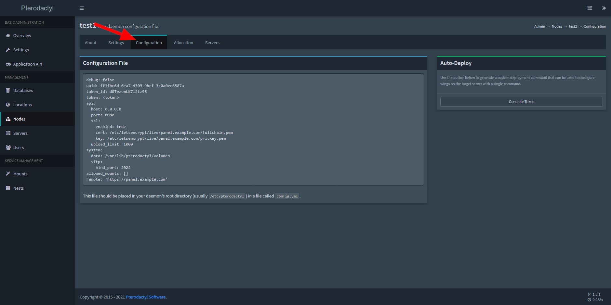

# 创建新的节点
 
## 位置
前往管理面板并单击左侧边栏上的节点选项卡。然后点击右上角的“新建”，打开添加节点的页面。

## 需要的信息

* **节点名称**: 该识别节点身份的名称
* **描述**: 帮助你快速定位节点内容和位置的信息
* **区域**: 节点所在区域,这些在'地域'可以添加和修改,它必须先创建才能添加服务器节点
* **FQDN**: 后端服务器的主机名,可以是域名也可以是IP(启用SSL推荐使用域名)例如: `node.pterodactyl.io`
* **通过SSL连接**: 如果面板使用HTTPS建立连接,那么后端WINGS也应该使用SSL
* **代理**: 如果后端程序套有代理,如CF等就需要开启它,没有则不需要管
* **守护程序服务器文件目录**: 服务器后端用来储存服务端数据的文件夹,一般是 `/var/lib/pterodactyl/volumes`.

::: tip OVH 用户
一些OVH虚拟化类型的服务器的 `/home` 文件夹是储存空间最大的,你也许可以用 `/home/pterodactyl/volumes` 来储存数据
:::

* **总运行内存容量**: 允许服务器自动创建的最大运行内存容量
* **内存过额分配**: 允许超开内存的百分比,比如你设置节点可以开10GB的内存,如果填写20那么将可以开12GB内存
* **总储存容量**: 允许服务器自动创建的最大储存容量
* **储存过额分配**: 同内存过额分配

::: danger
不要忘记考虑操作系统开销和机器上的其他软件要求。
::: 

* **守护进程端口**: 守护进程监听端口
* **守护进程SFTP端口**: 守护进程的SFTP监听端口

## 安装后端
您需要把 Wings,即守护进程程序安装到服务器节点,[文档](/wings/1.0/installing)
获得更多信息,你可以去社区查看不同Linux发行版的安装教程[CentOS](/community/installation-guides/wings/centos7),
[Ubuntu](/wings/1.0/installing), 或 [Debian](/community/installation-guides/wings/debian).

## 配置节点
进入节点配置页面

复制这些配置到 `config.yml` 文件 (一般是在 `/etc/pterodactyl/config.yml` 中放置,没有相应的文件夹和文件记得创建!)

### 自动部署
这将会自动生成一个在后端服务器运行的命令
