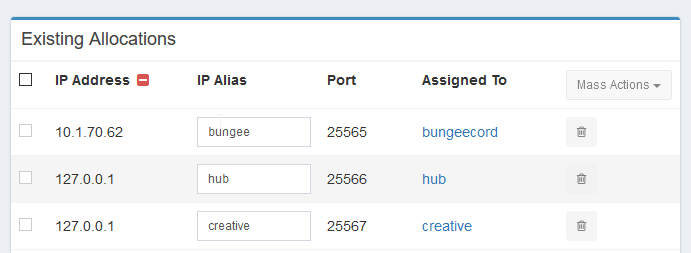
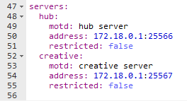
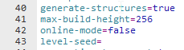
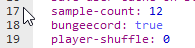

# Minecraft

## 配置服务器网络 (BungeeCord, Waterfall, HexaCord, 等等)

如果你想安全地操作像BungeeCord，Waterfall，HexaCord等Minecraft代理服务器，只要你停留在同一个节点上，你就可以单独使用翼龙来实现。它与传统设置有几个不同之处，可能需要额外的防火墙规则，这就是本指南的目的。

:::warning
对于下面描述的设置，所有服务器必须在同一个节点上。
:::

::: danger
如果您是托管提供商，并且将其出售给客户，则每个节点应该只允许一个代理网络。
:::

### 面板中的分配

为代理服务器创建一个常规分配，它使用节点的外部IP，这样用户就可以到达它。

代理后面的实际游戏服务器应该使用 `127.0.0.1` 作为地址的分配，这样它们只能在节点上被访问，而不能被公众访问。

#### 示例



`10.1.70.62` 是一个例子，用你自己的公共IP地址替换它。

### 代理服务器设置

由于代理服务器，像所有服务器一样，都在具有网络隔离的docker容器中运行，`localhost`/`127.0.0.1`并不指向节点，而是指向容器。节点可以从容器内部使用 `172.18.0.1`（除非pterodactyl网络配置不同）来访问。因此，你需要在你的代理服务器配置中使用这个IP。

::: tip
但我非常推荐到 `服务器` -> `设置` -> `DEBUG 调试信息` -> `服务器 ID` 来实现同一节点下互联的方式，这个是指向性的！
:::

#### bungeecord/waterfall配置

这将对其他代理服务器有所不同，请参考他们的文档。



### paper/spigot/bukkit设置

服务器本身需要由服务器代理所需的常规配置选项，这通常归结为禁用在线模式。这将对其他服务器软件有所不同，请参考他们的文档。

#### server.properties

设置online-mode为`false`


#### spigot.yml

设置bungeecord为`true`


### 防火墙

如果你正在使用防火墙，可能需要额外的规则来允许服务器在节点上互相访问。在这种情况下，代理服务器需要访问其后面的所有游戏服务器。因此，我们需要允许来自翼龙网络的流量到达 localhost 上的服务器端口。

你可以使用以下命令作为示例。`172.18.0.1`是默认地址，指的是在翼龙网络内的节点。将 `<LOCALHOST_PORT>` 替换为游戏服务器的分配的 localhost 端口。

:::warning
以下命令将允许节点上的任何服务器访问打开的端口。
:::

#### UFW (Ubuntu)

允许在特定端口上访问翼龙的 pterodactyl0 网络。

``` bash
ufw allow in on pterodactyl0 to 172.18.0.1 port <LOCALHOST_PORT> proto tcp
```

#### Firewalld (CentOS)

允许从 pterodactyl0 网络访问 pterodactyl0。

:::warning
此命令将允许任何服务器访问所有其他服务器以及节点上的所有端口。
:::

``` bash
firewall-cmd --permanent --zone=public --add-source=172.18.0.1
```
