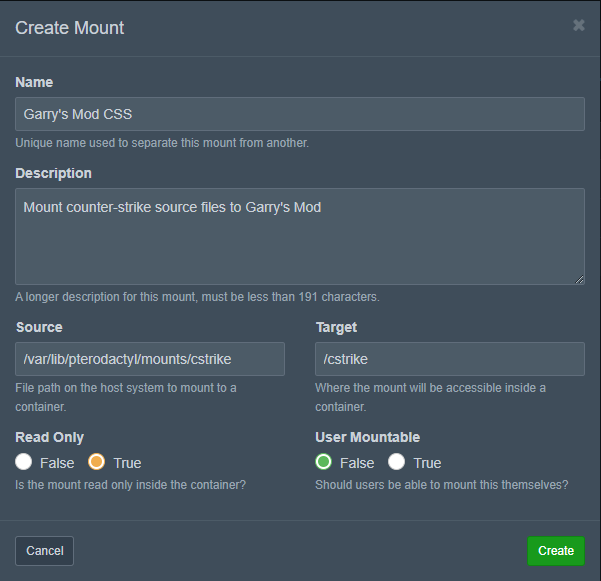

# 使用挂载

挂载是一项允许管理员将主机文件系统中的其他目录安装到服务器容器中的功能。

## Wings 配置

出于安全原因，默认情况下无法在节点上挂载目录。必须在 Wings 配置中明确指定应该可挂载的目录。

在 Wings 配置文件 (`/etc/pterodactyl/config.yml`) 中，`allowed_mounts` 字段用于列出可挂载的目录。列出一个目录时(可以列出多个)，在这个目录下的所有子目录都可以挂载，而不需要再次设置。

```yml
allowed_mounts:
- /example
```

您必须重新启动 Wings 才能将新更改的内容应用到您的 Wings 配置中。

## 面板配置

您必须在管理面板中配置挂载才能将它们与您的服务器一起使用。它们由节点上的来源路径和将在容器中安装的目标路径(挂载路径)组成。

:::tip 容器中的路径
挂载可以挂载到 `/home/container` 里，包括其任何子目录中，例如将服务器 A 的目录或其他服务器目录交叉挂载到服务器 B 中。但需要主意，要挂载的文件夹必须存在，挂载才能正常工作
:::

### 创建挂载

1. 在管理面板中找并打开 **挂载**。
2. 创建一个新的挂载。
3. 按要求填写详细信息。
   - **名称**: 您的挂载名称。
   - **描述**: 您的挂载描述。
   - **来源路径**: 节点机器上的文件夹或文件的绝对路径。
   - **挂载路径**: 挂载将放置在服务器内部的绝对路径。如果路径中包含 `/home/container`，请确保该文件夹存在。
   - **只读**: 在容器文件系统内此挂载是否为只读。
   - **用户可挂载**: 是否允许用户自行挂载此挂载。
4. 创建挂载后，您需要添加可以使用此挂载的 **预设** 和 **节点**。

:::warning 多台服务器使用的挂载
所有使用相同挂载的服务器将**仅**在同一节点上共享其内容。挂载在节点之间不同步。
:::

### 为服务器分配挂载

1. 在管理面板中导航到您想要使用挂载的服务器
2. 进入挂载页面
3. 点击 **+** 按钮
4. 重启服务器

挂载的文件应该在容器的目标路径中可用。您可以暂时将服务器启动命令更改为 `ls <挂载目标>`，如果配置正确，它应该会输出安装的内容。

:::warning 无法访问挂载
挂载不会出现在面板的文件管理器中，也不能通过 SFTP 访问。 但是!服务器本身将能够查看并使用这些挂载内容。
:::

### 挂载实例

下面的示例挂载存储在路径 `/var/lib/pterodactyl/mounts` 中，我们将其添加到 Wings `config.yml` 中

```yml
allowed_mounts:
  - /var/lib/pterodactyl/mounts
```


