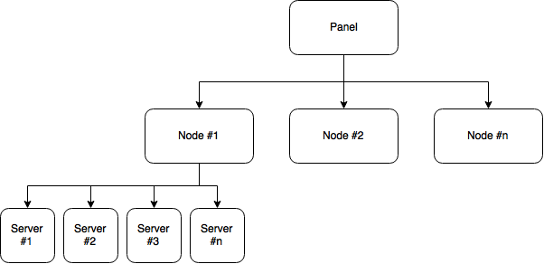

# 术语
**面板(Panel)** — 这指的是翼龙面板本身，它允许您向系统添加额外的节点和服务器。

**节点(Node)** — 节点是运行 Wings 实例的物理主机。

**Wings** — 用 Go 编写的新服务软件，它与 Docker 和面板交互，让面板控制服务器时提供安全访问。

**服务器(Server)** — 在这种情况下，服务器是指由面板创建的正在运行的实例。这些服务器是在节点上创建的，您可以在每个节点上拥有多个服务器。

**Docker** — Docker 是一个平台，可让您将应用程序与基础设施分离到隔离的安全容器中。

**Docker镜像(Docker Image)**  — 一个 Docker 镜像包含运行容器化应用程序所需的一切。 （例如用于 Minecraft 服务器的 Java）。

**容器(Container)** — 每台服务器都将在一个隔离的容器内运行，以强制执行硬件限制（例如 CPU 和 RAM）并避免一个节点上的服务器之间产生任何干扰。这些都将由 Docker 创建。

**预设组(Nest)** — 每个预设组通常用作特定的游戏或服务，例如：Minecraft、Teamspeak 或 Terraria，并且可以包含许多预设。

**预设(Egg)**  — 每个预设通常用于存储特定类型的游戏配置，例如：Minecraft 的 Vanilla、Spigot 或 Bungeecord。

**Yolks**  — 可与翼龙的预设一起使用的 Docker 镜像，部分内容可能高度定制。

## 简单设置示意图

## 高级设置示意图
::: tip 面板和 Wings 在同一台主机上
也可以在面板主机上安装 Wings，使其同时充当面板和节点的主机。
:::

