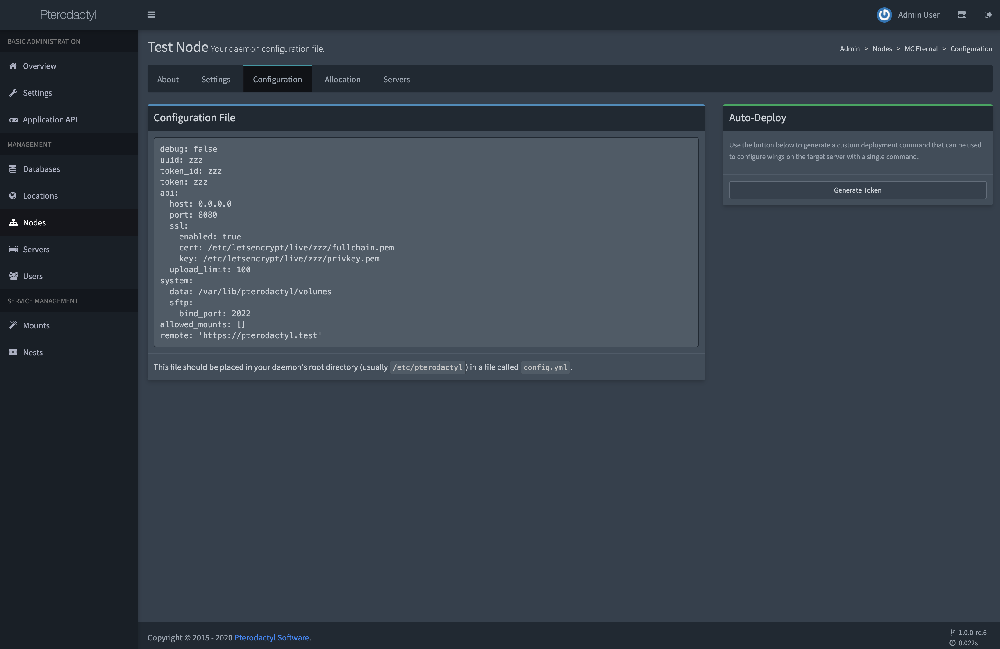

# 迁移至 Wings
本指南适用于希望从旧的 Node.JS 守护程序迁移到 Wings 的人。如果您是第一次尝试在新节点上安装 Wings，请参阅 [安装指南](/wings/1.0/installing.md) 。

::: 面板版本要求
您**必须**运行 Pterodactyl Panel 1.X 才能使用 Wings。
:::

执行此过程时，您将有一段短暂的离线时间，但不会影响正在运行的游戏进程。此外，在此期间，您的 Panel 可能会离线（或处于维护模式），因此您的用户不应注意到任何异常情况。

## 安装 Wings
安装守护程序的第一步是确保我们具有所需的目录结构设置。为此，请运行以下命令，该命令将创建基本目录并下载 Wings 可执行文件。

``` bash
mkdir -p /etc/pterodactyl
curl -L -o /usr/local/bin/wings https://github.com/pterodactyl/wings/releases/latest/download/wings_linux_amd64
chmod u+x /usr/local/bin/wings
```

## 复制新的配置文件
安装 Wings 后，您需要从面板中复制一个新的配置文件。此文件采用新格式，将来应该更易于管理和编辑。

只需复制并粘贴代码块并将其粘贴到`/etc/pterodactyl`目录中的`config.yml`文件。



::: 警告
请注意，您之前对配置所做的任何修改都将丢失。如果您对我们的默认设置进行了修改，最好的选择是使用复制的配置启动 Wings 一次，然后将填充所有其他配置设置。

从那里您可以根据需要进行任何调整。
:::

## 移除旧的守护进程
现在安装了 Wings，我们需要从服务器中删除所有旧的守护程序代码，因为它不再被使用。为此，只需执行以下命令 - 假设您的旧守护程序位于默认`/srv/daemon`目录中。

```bash
# 停止旧的守护程序
systemctl stop wings

# 删除整个目录。这里没有任何我们在这次迁移中实际需要的东西。
# 请记住，服务器数据是存储在/srv/daemon-data中的。
rm -rf /srv/daemon

# 如果它没有被用于任何其他用途，可以选择从你的系统中删除NodeJS。
apt -y remove nodejs # 或: yum remove nodejs
```

### 删除独立 SFTP
如果您使用带有旧守护程序的 [独立SFTP服务器](/daemon/0.6/standalone_sftp.html) ，我们也需要删除它的 systemd 服务，因为它不再需要。
您可以使用以下命令执行此操作。

```bash
# 停止并禁用独立sftp
systemctl disable --now pterosftp

# 删除systemd服务
rm /etc/systemd/system/pterosftp.service
```

## Wings 守护进程
然后，您需要编辑现有 `systemd` 的 Wings 服务文件以指向新的控制软件。为此，请打开 `/etc/systemd/system/wings.service`文件并将其中的全部内容替换为以下内容：

```
[Unit]
Description=Pterodactyl Wings Daemon
After=docker.service

[Service]
User=root
WorkingDirectory=/etc/pterodactyl
LimitNOFILE=4096
PIDFile=/var/run/wings/daemon.pid
ExecStart=/usr/local/bin/wings
Restart=on-failure
StartLimitInterval=600

[Install]
WantedBy=multi-user.target
```

然后，启动翅膀。

```
systemctl daemon-reload
systemctl enable --now wings
```

::: 如果 Wings 没有启动怎么办？
如果此时您在启动 Wings 时遇到问题，请运行以下命令直接启动 Wings 并检查是否有任何特定的错误输出。

```
sudo wings --debug
```
:::
